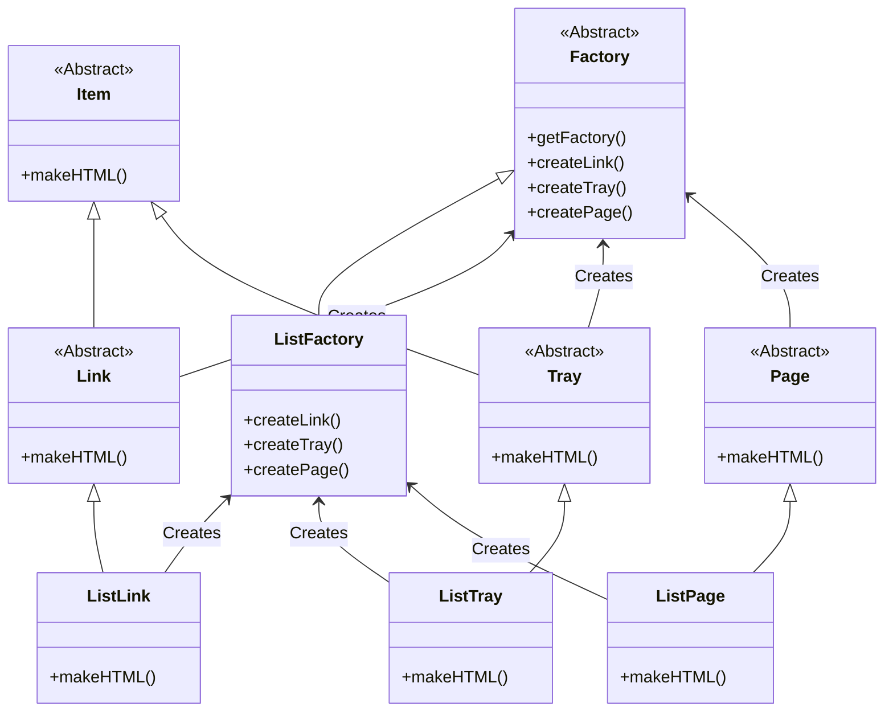

## クラス図

```mermaid
classDiagram
    class Factory {
        <<Abstract>>
        +getFactory()
        +createLink()
        +createTray()
        +createPage()
    }
    class ListFactory {
        +createLink()
        +createTray()
        +createPage()
    }
    Factory <|-- ListFactory
    Factory <-- Link : Creates
    Factory <-- Tray : Creates
    Factory <-- Page : Creates
    
    class Item {
        <<Abstract>>
        +makeHTML()
    }
    class Link {
        <<Abstract>>
        +makeHTML()
    }
    class Tray {
        <<Abstract>>
        +makeHTML()
    }
    class Page {
        <<Abstract>>
        +makeHTML()
    }
    Item <|-- Link
    Item <|-- Tray
    
    class ListLink {
        +makeHTML()
    }
    class ListTray {
        +makeHTML()
    }
    class ListPage {
        +makeHTML()
    }
    Link <|-- ListLink
    Tray <|-- ListTray
    Page <|-- ListPage
    ListFactory <-- ListLink : Creates
    ListFactory <-- ListTray : Creates
    ListFactory <-- ListPage : Creates
```