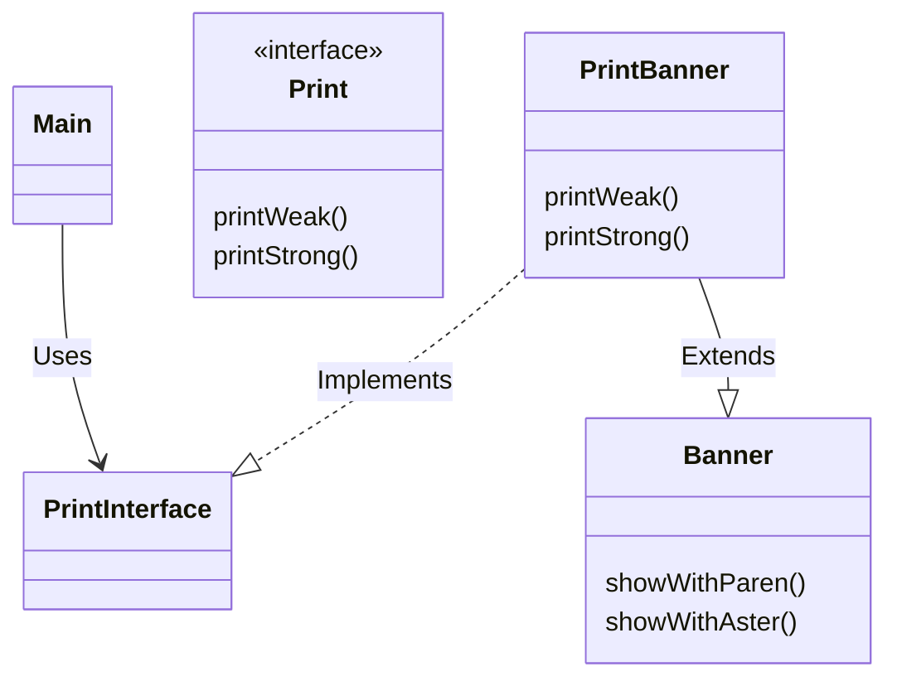

## クラス図

```mermaid
classDiagram
    class Main {
    }
    class Print {
        <<interface>>
        printWeak()
        printStrong()
    }
    class PrintBanner {
        printWeak()
        printStrong()
    }
    class Banner {
        showWithParen()
        showWithAster()
    }

    Main --> PrintInterface : Uses
    PrintBanner ..|> PrintInterface : Implements
    PrintBanner --|> Banner : Extends
```