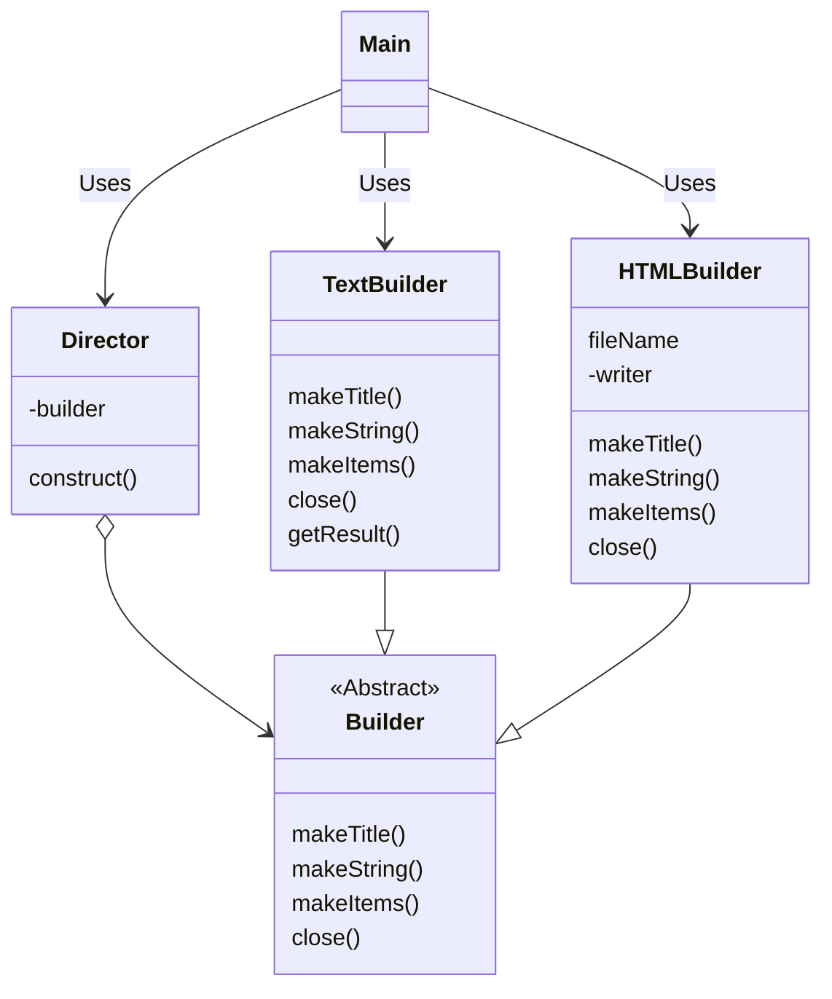

## クラス図

```mermaid
classDiagram
    class Main {}
    class Director {
        -builder
        construct()
    }
    class Builder {
        <<Abstract>>
        makeTitle()
        makeString()
        makeItems()
        close()
    }
    class TextBuilder {
        makeTitle()
        makeString()
        makeItems()
        close()
        getResult()
    }
    class HTMLBuilder {
        fileName
        -writer
        makeTitle()
        makeString()
        makeItems()
        close()
    }

    Main --> Director : Uses
    Main --> TextBuilder : Uses
    Main --> HTMLBuilder : Uses
    Director o--> Builder
    TextBuilder --|> Builder
    HTMLBuilder --|> Builder
```