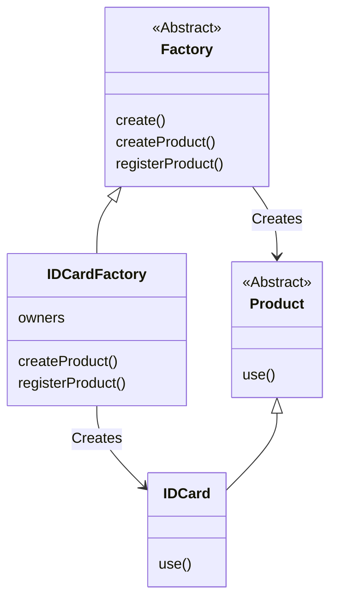

## クラス図

```mermaid
classDiagram
    class Factory {
        <<Abstract>>
        create()
        createProduct()
        registerProduct()
    }
    class Product {
        <<Abstract>>
        use()
    }
    class IDCardFactory {
        owners
        createProduct()
        registerProduct()
    }
    class IDCard {
        use()
    }

    Factory --> Product : Creates
    IDCardFactory --> IDCard : Creates
    Factory <|-- IDCardFactory
    Product <|-- IDCard
```