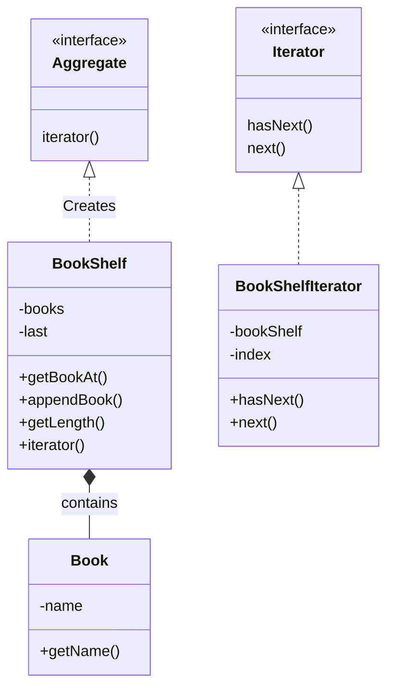

## クラス図

```mermaid
classDiagram
  class Aggregate {
      <<interface>>
      iterator()
  }
  class Iterator {
      <<interface>>
      hasNext()
      next()
  }
  Aggregate <|.. BookShelf : Creates
  Iterator <|.. BookShelfIterator
  class BookShelf {
      -books
      -last
      +getBookAt()
      +appendBook()
      +getLength()
      +iterator()
  }
  class BookShelfIterator {
      -bookShelf
      -index
      +hasNext()
      +next()
  }
  class Book {
      -name
      +getName()
  }
  BookShelf *-- Book : contains
```