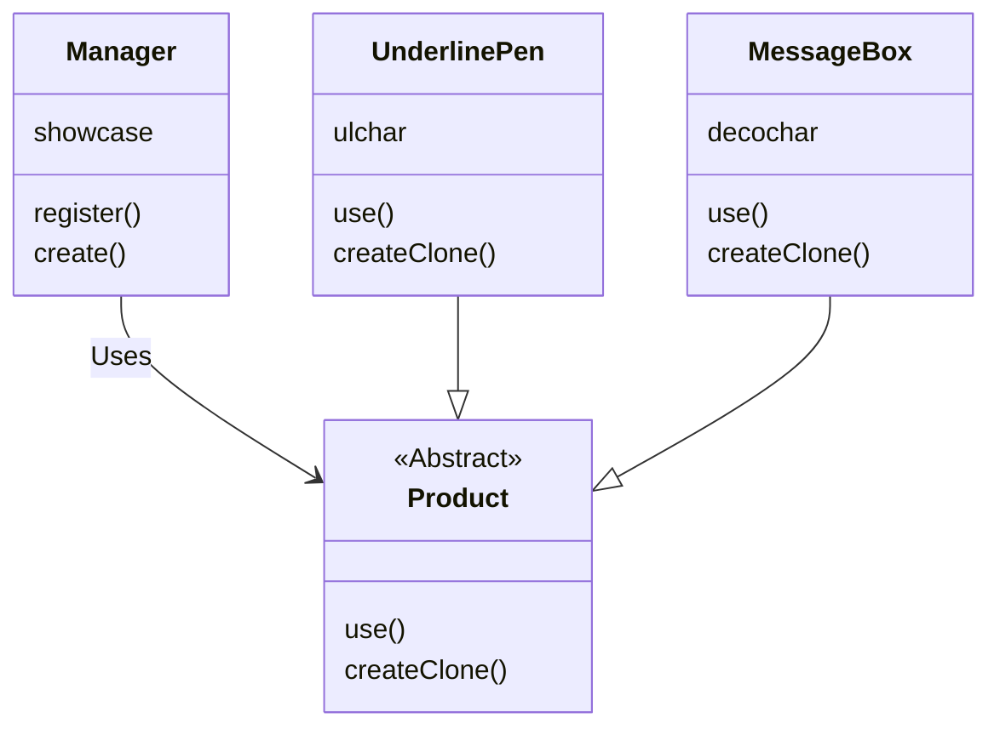

## クラス図

```mermaid
classDiagram
    class Manager {
       showcase
       register()
       create()
    }
    class Product {
        <<Abstract>>
        use()
        createClone()
    }
    class UnderlinePen {
        ulchar
        use()
        createClone()
    }
    class MessageBox {
        decochar
        use()
        createClone()
    }
    
    Manager --> Product : Uses
    UnderlinePen --|> Product
    MessageBox --|> Product
```