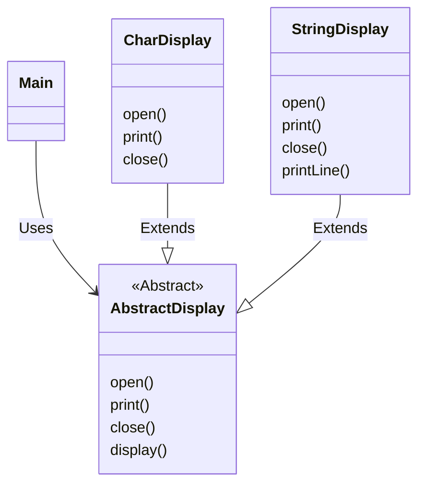

## クラス図

```mermaid
classDiagram
    class Main {
    }
    class AbstractDisplay {
        <<Abstract>>
        open()
        print()
        close()
        display()
    }
    class CharDisplay {
        open()
        print()
        close()
    }
    class StringDisplay {
        open()
        print()
        close()
        printLine()
    }

    Main --> AbstractDisplay : Uses
    CharDisplay --|> AbstractDisplay : Extends
    StringDisplay --|> AbstractDisplay : Extends
```